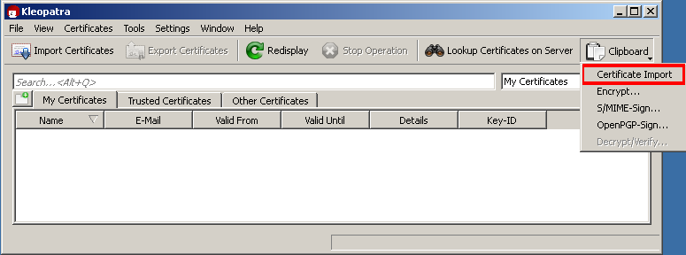
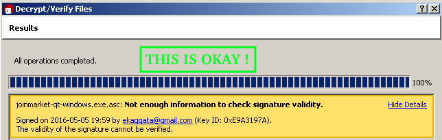
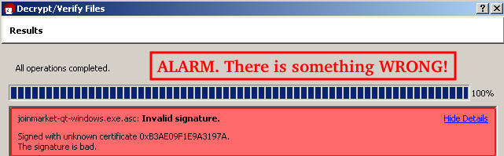

# Verify your download of Joinmarket binary's file integrity

This step is optional but highly recommended, because it makes sure that your downloaded file has not been tempered with by any third party.

## Steps

Verify signature (optionial, but recommended):

1. Get gpg4win: [GPG4WIN Download](https://gpg4win.org/download.html) . Choose the full version, as only that one will include the Kleopatra component, which we will be using.

2. Install it (standard settings are ok)

3. Get Adam's (creator of Joinmarket binary) public key from [THIS LINK](https://raw.githubusercontent.com/JoinMarket-Org/JMBinary/0349698ebf60de384c0469b8b11cabe7d414e2d1/pubkeys/AdamGibson.asc) and mark everything, then ctrl-c to copy it to clipboard

4. Start the "Kleopatra" program from gpg4win

5. click on "Clipboard" (top-right) and choose "Certificate import". If it's greyed out, check that you really copied the whole GPG-block:

6. Choose the tab "other certificates". You should see Adam Gibson's certificate there.

7. Right-click on it and choose "Certificate details".

8. Make sure that the "Fingerprint" given there matches this fingerprint: 4668 9728 A9F6 4B39 1FA8  71B7 B3AE 09F1 E9A3 197A. After you verfied this, you can close the window.

9. Still in Kleopatra, select File --> decrypt/verify files

10. Navigate to and then select the file joinmarket-qt-windows.exe (the .asc file must be in the same directory) and click decrypt/verify. It will display "not enough info to check signature validity" (in yellow warning color), but that's okay as long as you checked the fingerprint of the certificate before. "Invalid signature" (in red error color) would be bad and a sign that you must not use the file you downloaded. 
This is fine: 
 
This would be **very bad. Do not continue**: 

11. Kleopatra can be closed now. The file you downloaded has not been tampered with, if steps 8 and 10 checked out.

[Back to the Joinmarket binary readme](../README.md)
